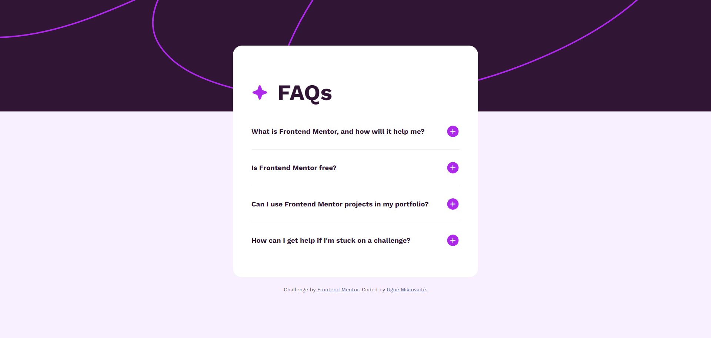
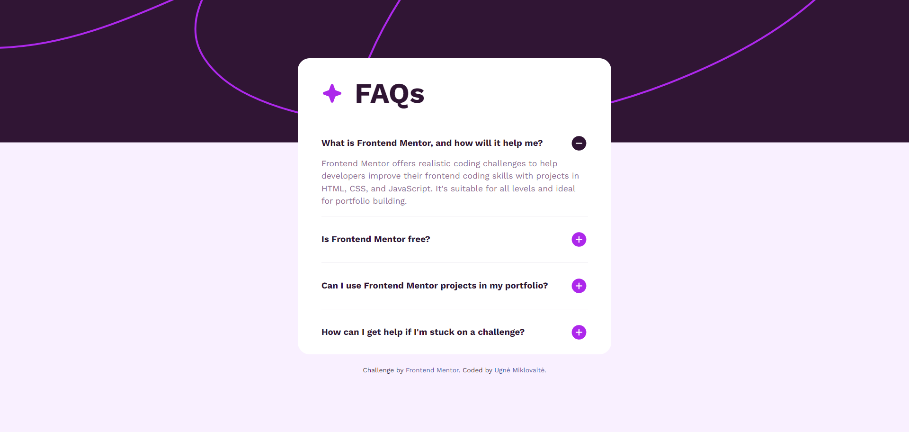
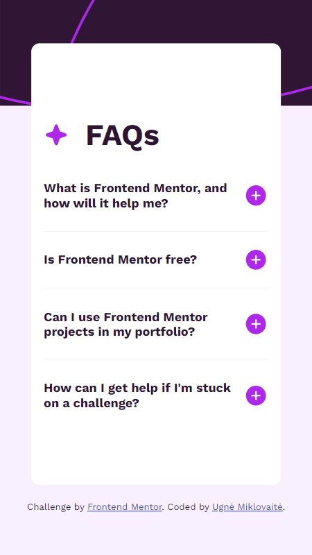
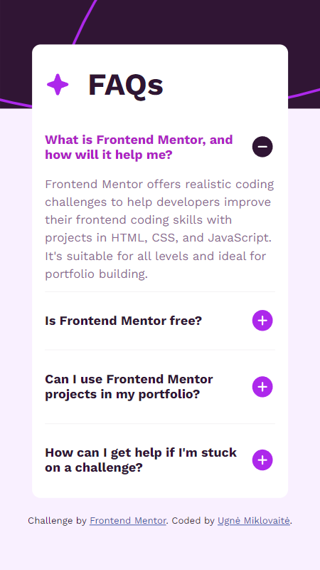

# Frontend Mentor - FAQ Accordion

## Welcome! 👋

Thanks for checking out this front-end coding challenge.

### Features:
- **Hide/Show Answers**: Users can hide or show the answer to a question by clicking on the question.
- **Keyboard Navigation**: Users can navigate the questions and hide/show answers using keyboard navigation, pressing the space or ENTER buttons.
- **Responsive Design**: The layout adjusts optimally for different screen sizes.
- **Interactive Elements**: All interactive elements include hover and focus states for improved accessibility and user experience.

## Screenshots:

### Desktop View:

### Desktop View 2:

### Mobile View:

### Mobile View 2:

Feel free to explore the project and suggest any improvements or changes!